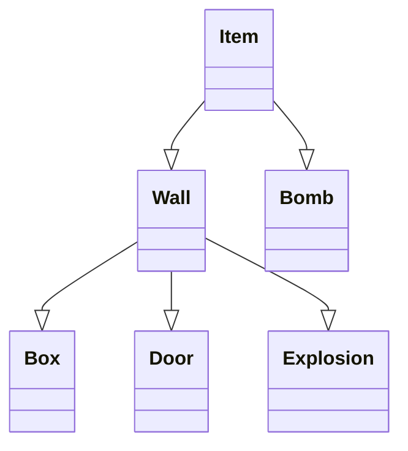
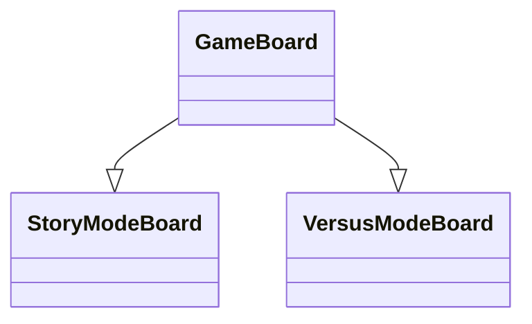
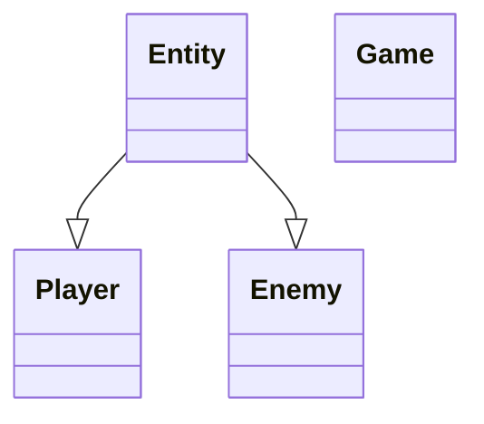

<h1 style="text-align: center;">Bomberman</h1>
This is our interpretation of the classic Bomberman game. We created the game with three game modes:

- Versus mode - two players playing on one computer face each other to see who can blow up the other one.
- Story mode - one player ventures out on the adventure to find an exit from the mines. He needs to destroy boxes and avoid enemies to find the door that will allow him to leave.
- Cooperation mode - two players venture out on the adventure to find the exit from the mines. They need to destroy boxes and avoid enemies to find the door that will allow them to leave.

<h3 style="text-align: center;">How to play</h3>
:warning: This project makes use of the Sfml library. If you do not have it instaled, please follow the quick installation guide at the end of this file.

If you want to start the game, please open the main.cpp file and compile it. Then you will see the main menu of the game, where you choose which game mode you want to play. If you choose Story mode or Cooperative mode, you then need to choose whether you want to play a new game or open a saved one, and then you need to choose the save.
<h4>How to play Versus</h4>
After you choose the Versus mode, you are automatically loaded to the game. The first player is located in the upper left corner and is controlled using WSAD keys and space. The second player is located in the lower right corner and is controlled using arrow keys and enter key. The goal of the game is to kill another player. If the player is killed game stops, and results are displayed. To restart press any key. If you press, escape, you open pause menu.
<h4>How to play Story</h4>
After you choose the Versus mode, you need to choose whether you want to play a new game or you want to load one of the saves. If you choose to play new game, you need to choose which save you want to overwrite. If you choose to play a load game, you need to choose which save you want to open. After that, you are loaded into the game. You need to find a door to enter another level. You have three lives, and you can lose them by walking into enemies and explosions. If you lose all three lives, current level gets restarted, and you lose all the points that you gathered on that level. Your points are displayed in the bottom left corner. Levels are randomly generated and get progressively harder. This game mode does not have any end. It is similar to the endless runner games.
<h4>How to play Cooperative</h4>
This game mode is similar to the Story mode. The only differences are that there are two players, they share lives, and their score is combined.
<h3 style="text-align: center;">Code discription</h3>
There are 45 files that are either .h or .cpp files. There are 20 classes combined. Six classes represent items that the player can see on the board. Three classes represent Entities that can be seen in the game. Three classes represent a type of board. Seven classes represent Menu types. One that represents the game.





```mermaid
classDiagram
```
:exclamation: Those are only simple class diagrams and there are no methods or atributes on them to make those diagrams easier to read.