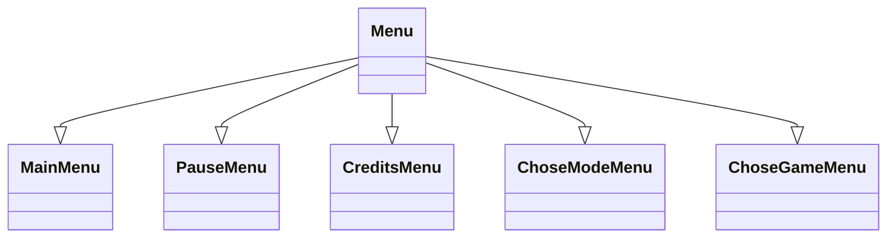

<h1 style="text-align: center;">Bomberman</h1>
This is our interpretation of the classic Bomberman game. We created the game with three game modes:

- Versus mode - two players playing on one computer face each other to see who can blow up the other one.
- Story mode - one player ventures out on the adventure to find an exit from the mines. He needs to destroy boxes and avoid enemies to find the door that will allow him to leave.
- Cooperation mode - two players venture out on the adventure to find the exit from the mines. They need to destroy boxes and avoid enemies to find the door that will allow them to leave.

<h3 style="text-align: center;">How to play</h3>
:warning: This project makes use of the Sfml library. If you do not have it instaled, please follow the quick installation guide at the end of this file.

Firstly you need to clone latest version of the git repository or download zip file. Then you need to open proi-project-bomberman folder(or similarly named one)(if you are using VisualStudio you need to open Bomberman project).

If you want to start the game, please open the main.cpp file and compile it. Then you will see the main menu of the game, where you choose which game mode you want to play. If you choose Story mode or Cooperative mode, you then need to choose whether you want to play a new game or open a saved one, and then you need to choose the save.
<h4>How to play Versus</h4>
After you choose the Versus mode, you are automatically loaded to the game. The first player is located in the upper left corner and is controlled using WSAD keys and space. The second player is located in the lower right corner and is controlled using arrow keys and enter key. The goal of the game is to kill another player. If the player is killed game stops, and results are displayed. To restart press any key. If you press, escape, you open pause menu.
<h4>How to play Story</h4>
After you choose the Versus mode, you need to choose whether you want to play a new game or you want to load one of the saves. If you choose to play new game, you need to choose which save you want to overwrite. If you choose to play a load game, you need to choose which save you want to open. After that, you are loaded into the game. You need to find a door to enter another level. You have three lives, and you can lose them by walking into enemies and explosions. If you lose all three lives, current level gets restarted, and you lose all the points that you gathered on that level. Your points are displayed in the bottom left corner. When you find the door level statistics are displayed and you move to next level. Levels are randomly generated and get progressively harder. This game mode does not have any end. It is similar to the endless runner games.
<h4>How to play Cooperative</h4>
This game mode is similar to the Story mode. The only differences are that there are two players, they share lives, and their score is combined.
<h3 style="text-align: center;">Code discription</h3>
There are 43 files that are either .h or .cpp files. There are 19 classes combined. Six classes represent items that the player can see on the board. Three classes represent Entities that can be seen in the game. Three classes represent a type of board. Six classes represent Menu types. One that represents the game.

:exclamation: Those are only simple class diagrams and there are no methods or atributes on them to make those diagrams easier to read.
<h4>Item</h4>
This class represents items that can be seen on the board. It has four protected attributes:

- name_
- item_sprite_
- sprite_size_
- item_textures_

There are nine public methods:

- Move - can move item given distance. In this project, it is - mainly used for shifting the whole game board so that player stays on the screen.
- set_name - setter for name_ attribute
- name - getter for name_ attribute
- item_sprite - getter for item_sprite_ attribute
- load_immage_from_file - loads image onto the items sprite
- draw_to - draws item onto the given render window
- set_position - setter for the items position
- position - getter for the position of the item
- rescale - setter for the items scale
<h4>Wall</h4>
This class inherits after Item and represents Wall, which player cannot penetrate. It has one private attribute:

- wall_texture_path_

This class also has two public methods and three constructors. The methods are:

- get_global_bounds
- is_coloding_player
<h4>Bomb</h4>
This class inherits after Item and represents Bomb, which player canplace. It has six private attributes:

- radius_
- delay_
- stregth_
- placement_time_
- position_on_board_
- texture_path_

This class also has three constructors and eight methods.
- set_radius
- radius
- set_delay
- delay
- set_strength
- strength
- did_blow
- position_on_board
<h4>Box</h4>
This class inherits after Wall class and represents box that player can see in the game and can also destroy them. It has two private atributes:

- hits_to_brake_
- box_texture_path_

This class also has three constructors and three public methods:

- set_hits_to_brake
- hits_to_brake
- hit
<h4>Door</h4>
This class inherits after Wall class and represents Door that player needs to find. It has one private method:

- door_texture_path_

This class also has three constructors.
<h4>Explosion</h4>
This class inherits after Wall class and represents explosions that Bomb creates. It has two private atributes:

- duration_
- explosion_time_

This class also has three constructors and one poblic method:

- did_end

<h4>GameBoard</h4>
This class represents GameBoard that players moves around on. It has six protected attributes:

- background_
- items_on_board_
- max_boxes_on_board_
- players_
- wall_texture_
- box_texture_

This class also has twelve public methods and one template method:

- remove_item
- load_bacground
- bacground
- add_item - template
- items
- item
- players
- add_player
- draw_to
- move_items
- get_door_global_bounds
- reset_board
- level_number

<h4>StoryModeBoard</h4>
This class inherits after GameBoard class, and it represents GameBoard that is used in the Stor and Cooperative modes. It has seven private atributes:

- level_number_
- door_
- door_texture_
- where_door_can_ocure
- dificulty_map_
- box_strength_map_
- size_

This class also has one constructor and six public methods:

- draw_to
- level_number
- door_position
- get_door_global_bounds
- move_items
- reset_board

<h4>VersusModeBoard</h4>
This class inherits after GameBoard class, and it represents GameBoard that is used in the Versus mode. It has one private atribute:

- size_

This class also has one constructor and one public method:
- size

<h4>Game</h4>
This class is the bigest class in the whole project. It is responsible for palying verious modes. It probably could have been separated into two or three classes (for example Game nad Phisics) but i realised that to late into writing it and at that point it was a bit like untangling headphones. It has few intresting algorithms but their are described in different sction. This class has seventeen private atributes, eight of them are different textures, other are:

- pixels_moved_
- game_board_
- points_
- players_
- bombs_on_b_
- is_player_stationary_
- explosions_
- enemies_
- explosions_on_board_

This class has one constructor and only one public method:

- play

Other methods ar private because they are responsible for running the game.
<h3 style="text-align: center;">Algorithms</h3>
In this section few more complex algorithms are described.
<h4>Moving player</h4>
Mocing player is one of the most important things in the game. We decided to make our game board bigger than screen so way of moving "camera" had to be created. This part isn't realy just small portion of the code it is combination of few methods and also makes use of Composite programing pater to ask object to draw themselves ont the window. It comes down to moving everything except the player. I think this algorith somewhat sumerises how different you sometimes have to think to solve some programing chalanges.

Other part of moving player is object colision. It was really hard to create perfect algorithm, but at the end I think that it came uot prety well. It make use of sfml method intersect that check if two objects intersect. But before that this algorithm chack which direction player moves. Ater that it checks if player is coliding with boject on his corespondinh side and if yes sets player position right in front of the object.

<h4>Explosion Detection</h4>
This algorithm is esential part of this game. It was quite a chalange to create good one. Fortunetly I mannaged to do so. Explosion is created in form of the cross 9 by 9 board spaces. Than the algorithm checks if explosion is placed on the wall if yes than this explosions number and every explosions that comes after in the same line is pushed back into vector. Then explosions which numbers are in the vectore are deleted. After that it is checke if any boxes, players or enemyies intersect with explosions if yes they are also deleted or one life is taken away from them.
This algorithm is situated in chack_explosions_ and place_explosions_ private methods in Game class.
<h4>Generating Board</h4>
This one is quite simple one but it allows each level to look enique. I made use of rand c++ function to determine whether box needs to be placed in specific GameBoard position. I also used same function to determine where door to next level can be placed.