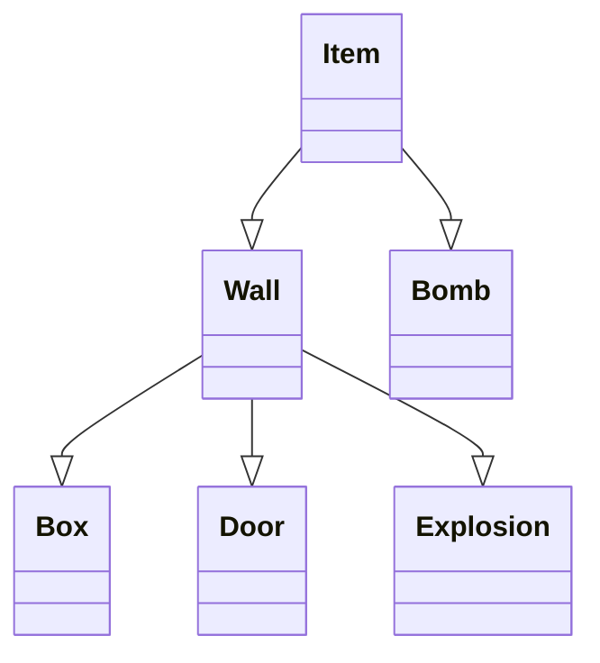
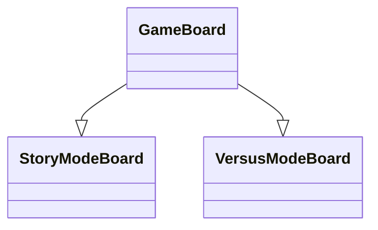
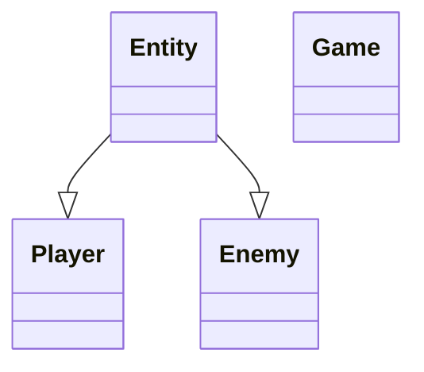
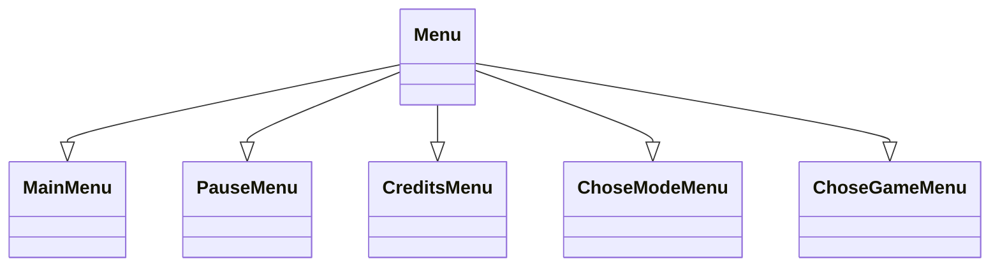

<h1 style="text-align: center;">Bomberman</h1>
This is our interpretation of the classic Bomberman game. We created the game with three game modes:

- Versus mode - two players playing on one computer face each other to see who can blow up the other one.
- Story mode - one player ventures out on the adventure to find an exit from the mines. He needs to destroy boxes and avoid enemies to find the door that will allow him to leave.
- Cooperation mode - two players venture out on the adventure to find the exit from the mines. They need to destroy boxes and avoid enemies to find the door that will allow them to leave.

<h3 style="text-align: center;">How to play</h3>
:warning: This project makes use of the Sfml library. If you do not have it instaled, please follow the quick installation guide at the end of this file.

Firstly you need to clone latest version of the git repository or download zip file. Then you need to open proi-project-bomberman folder(or similarly named one)(if you are using VisualStudio you need to open Bomberman project).

If you want to start the game, please open the main.cpp file and compile it (in Visual Studio in Realase). Then you will see the main menu of the game, where you choose which game mode you want to play. If you choose Story mode or Cooperative mode, you then need to choose whether you want to play a new game or open a saved one, and then you need to choose the save.
<h4>How to play Versus</h4>
After you choose the Versus mode, you are automatically loaded to the game. The first player is located in the upper left corner and is controlled using WSAD keys and space. The second player is located in the lower right corner and is controlled using arrow keys and enter key. The goal of the game is to kill another player. If the player is killed game stops, and results are displayed. To restart press any key. If you press, escape, you open pause menu.
<h4>How to play Story</h4>
After you choose the Versus mode, you need to choose whether you want to play a new game or you want to load one of the saves. If you choose to play new game, you need to choose which save you want to overwrite. If you choose to play a load game, you need to choose which save you want to open. After that, you are loaded into the game. You need to find a door to enter another level. You have three lives, and you can lose them by walking into enemies and explosions. If you lose all three lives, current level gets restarted, and you lose all the points that you gathered on that level. Your points are displayed in the bottom left corner. When you find the door level statistics are displayed and you move to next level. Levels are randomly generated and get progressively harder. This game mode does not have any end. It is similar to the endless runner games.
<h4>How to play Cooperative</h4>
This game mode is similar to the Story mode. The only differences are that there are two players, they share lives, and their score is combined.
<h3 style="text-align: center;">Code discription</h3>
There are 43 files that are either .h or .cpp files. There are 19 classes combined. Six classes represent items that the player can see on the board. Three classes represent Entities that can be seen in the game. Three classes represent a type of board. Six classes represent Menu types. One that represents the game. We tried to follow all of the object programing paradigmats and Bridge structural design pattern.
Every class has privete or protected atributes with getters and setters where needed.
We also created few abstract classes.

:exclamation: Those are only simple class diagrams and there are no methods or atributes on them to make those diagrams easier to read.
<h4>Item</h4>
This Abstract class represents items that can be seen on the board. It has four protected attributes:

- name_
- item_sprite_
- sprite_size_
- item_textures_

There are nine public methods:

- Move - can move item given distance. In this project, it is - mainly used for shifting the whole game board so that player stays on the screen.
- set_name
- name
- item_sprite
- load_immage_from_file
- draw_to
- set_position
- position
- rescale
<h4>Wall</h4>
This class inherits after Item and represents Wall, which player cannot penetrate. It has one private attribute:

- wall_texture_path_

This class also has two public methods and three constructors. The methods are:

- get_global_bounds
- is_coloding_player
<h4>Bomb</h4>
This class inherits after Item and represents Bomb, which player canplace. It has six private attributes:

- radius_
- delay_
- stregth_
- placement_time_
- position_on_board_
- texture_path_

This class also has three constructors and eight methods.
- set_radius
- radius
- set_delay
- delay
- set_strength
- strength
- did_blow
- position_on_board
<h4>Box</h4>
This class inherits after Wall class and represents box that player can see in the game and can also destroy them. It has two private atributes:

- hits_to_brake_
- box_texture_path_

This class also has three constructors and three public methods:

- set_hits_to_brake
- hits_to_brake
- hit
<h4>Door</h4>
This class inherits after Wall class and represents Door that player needs to find. It has one private method:

- door_texture_path_

This class also has three constructors.
<h4>Explosion</h4>
This class inherits after Wall class and represents explosions that Bomb creates. It has two private atributes:

- duration_
- explosion_time_

This class also has three constructors and one poblic method:

- did_end

<h4>GameBoard</h4>
This Abstract class represents GameBoard that players moves around on. It has six protected attributes:

- background_
- items_on_board_
- max_boxes_on_board_
- players_
- wall_texture_
- box_texture_

This class also has twelve public methods and one template method:

- remove_item
- load_bacground
- bacground
- add_item - template
- items
- item
- players
- add_player
- draw_to
- move_items
- get_door_global_bounds
- reset_board
- level_number

<h4>StoryModeBoard</h4>
This class inherits after GameBoard class, and it represents GameBoard that is used in the Stor and Cooperative modes. It has seven private atributes:

- level_number_
- door_
- door_texture_
- where_door_can_ocure
- dificulty_map_
- box_strength_map_
- size_

This class also has one constructor and six public methods:

- draw_to
- level_number
- door_position
- get_door_global_bounds
- move_items
- reset_board

<h4>VersusModeBoard</h4>
This class inherits after GameBoard class, and it represents GameBoard that is used in the Versus mode. It has one private atribute:

- size_

This class also has one constructor and one public method:
- size

<h4>Game</h4>
This class is the bigest class in the whole project. It is responsible for palying verious modes. It probably could have been separated into two or three classes (for example Game nad Phisics) but i realised that to late into writing it and at that point it was a bit like untangling headphones. It has few intresting algorithms but their are described in different sction. This class has seventeen private atributes, eight of them are different textures, other are:

- pixels_moved_
- game_board_
- points_
- players_
- bombs_on_b_
- is_player_stationary_
- explosions_
- enemies_
- explosions_on_board_

This class has one constructor and only one public method:

- play

Other methods ar private because they are responsible for running the game.

<h4> Player </h4>
This class represents actor, that can be controlled and moved by user using for this buttons WASD or keys (depends on mode of game).
It has four private attributes:

- hp                         - representing hitpoints of player
- last_texture_number        - additional variable for changing sprite of player
- time_since_texture_changed - additional variable for changing sprite of player
- quanity_bombs              - variable, that should represent quanity of bombs that player placed on gameboard - will be used in the future!

Public methods:

- get_hp
- set_last_texture_number
- get_last_texture_number
- set_hp
- set_quanity_bombs
- on_bomb
- can_textured_be_placed
- place_texture
- constructor with parameters

<h4> Menu </h4>
It is pure abstract class, which is parent for other menus, such as MainMenu, CreditsMenu etc. This class is very crucial, because it implements a lot of interactional logic with user and contains a lot of methods that are used in inherited classes.

Public methods:

- constructors with different parameters
- run     - method, that is called when this menu should be displayed
- poll_events - method, that checks input from user
- update - method, that check all interaction from user
- render - method, that allows to display all of the content on window
- mouse_over - method, that alllows to check if mouse is hover over the specific text field
- mouse_update - method, that polls event from mouse
- move_up - method, that is called when key W or arrow key up is pressed
- move_down - method, that is called when key S or arrow key down is pressed
- clicked_field - pure abstract method, that should be overrided in inherited classes

Protected fields:

- menu_clock - variable, to restrict user from to fast changing menu field
- menu_fields - vector of text elements, that can be clicked by user using mouse or keyboard
- window - window, where menu is rendered
- font - font for all menu fields
- bottom_menu_field - pointer to the menu field that is in the bottom
- top_menu_field - pointer to the menu field that is on top
- target_text - pointer to the menu field, that is choosen by user using mouse or keyboard ( has different color to differenciate it from inactive fields)
- background_texture - texture, that will be displayed like a background, not every inherited menu should have this variable.
- background - variable, for displaying background texture
- is_menu_open - variable, that checks if this menu is currently open

Other description of inherited classes you can find in code of that classes, they are very self-explanatory.

<h3 style="text-align: center;">Algorithms</h3>
In this section few more complex algorithms are described.
<h4>Moving player</h4>
Mocing player is one of the most important things in the game. We decided to make our game board bigger than screen so way of moving "camera" had to be created. This part isn't realy just small portion of the code it is combination of few methods and also makes use of Composite programing pater to ask object to draw themselves ont the window. It comes down to moving everything except the player. I think this algorith somewhat sumerises how different you sometimes have to think to solve some programing chalanges.

Other part of moving player is object colision. It was really hard to create perfect algorithm, but at the end I think that it came uot prety well. It make use of sfml method intersect that check if two objects intersect. But before that this algorithm chack which direction player moves. Ater that it checks if player is coliding with boject on his corespondinh side and if yes sets player position right in front of the object.

Looking in code for this algorithm some weird numbers can be spoted. Those numers were determined trought trail and error to make colision mechanics stable for players texture.

<h4> Moving Enemy </h4>
We have a lot of thoughts of how enemies can move. Starting of moving by using breadth-first search algorythm and ending by algorythm, in which enemy is running away from bombs. We tried to implement these algorythms into our program, but unfortunately it made performance of game very poor, so we rejected from this idea. Maybe we will think about it later and implement this in our project. So the last idea that could work was creating "random" movement. Idea of this algorythm is following: if next position of enemy does not "touch" walls, then it continues to go in the same direction. When next position of enemy "touch" some obstacle, then it checks all available directions, using which next position of enemy won't touch walls(can be right, left, bottom or top) and choose from them one direction randomly. Then it continues to move in that direction until next position of enemy won't detect other obstacle. Then algorythm repeats.

<h4>Explosion Detection</h4>
This algorithm is esential part of this game. It was quite a chalange to create good one. Fortunetly I mannaged to do so. Explosion is created in form of the cross 9 by 9 board spaces. Than the algorithm checks if explosion is placed on the wall if yes than this explosions number and every explosions that comes after in the same line is pushed back into vector. Then explosions which numbers are in the vectore are deleted. After that it is checke if any boxes, players or enemyies intersect with explosions if yes they are also deleted or one life is taken away from them.
This algorithm is situated in chack_explosions_ and place_explosions_ private methods in Game class.
<h4>Generating Board</h4>
This one is quite simple one but it allows each level to look enique. I made use of rand c++ function to determine whether box needs to be placed in specific GameBoard position. I also used same function to determine where door to next level can be placed.
<h3 style="text-align: center;">Tests</h3>
We created few tests that show how some of the methods work. Unfortunetly not all of the aspects of creating games can be tested using code. Some functionalities need to be tested by playing game over and over again.

If you want to fier tests you need to open bomberman_tests.cpp file and hit compile. All of the tests should be correct. Some of the tests are comented because they use system pause to generate expected outcome
<h3 style="text-align: center;">Our general toughts on the project</h3>
<h4>Miko�aj Chomanski</h4>
I personly think that in terms of writing code I did much better than in the last project, mainly because I created classes for everything. But I also see where I can improve, for example by spliting Game class into smaller classes.
Anohter area that I have improved in is the frequency of commits.
Of coure I also learnt a lot of thing while craeting this project. One of which is SFML, personly I think that this library has a lot of potential but it has some anoying quirks. For example I had really big problems with textures, thats why you can see textures in item class despite the fact that there are textures already in Game class. This problem is the fact that if texture is being keept as attribute in object and that object is turned into smart pointer, texture stops working. For that reason some parts of classes are prety much unused, I decided to keep them because I tought that those classes can be used in other implementations of the game( or other games). It does not folow "No, you won't need it" rule but I tought that if I have already created that code and it doesn't break anything it can stay.

I tried to follow all ot he programing paradigmats and I think that I did a prety good job of that. But I also think that I will be able to tell whether its true in few weaks or months time.

Looking back I would do somethings different, but at the same time I am proud of the way I did other things.

Some of the problems that may occure is the fact that bomb doesn't spawn even close to player. This problem is related to the fact that the board is moved. I think that I fixed it but I am not sure.

At the end I thin we did a pretty good job of creating our own version of Bomberman.

One more thing I defninetly could do better job of is creating Cmake file or working on one from the ground up.

<h4> Denys Fokashchuk</h4>
This project was pretty tough for me. The main reason was not writing code in C++, although it is harder than writing code in python, but working on team.

Earlier I worked only on my own and it was easy, because when only I write all code I understand everything, that is happening in the program. But when I work with someone else, I can not immediately understand what does some functions means and it takes some time to understand why something is working or is not working. And when we tried to combine my code and code of my groupmate we had some bugs that hard to understand why they even exists.

But working on team has also advantages: the main plus is that you have less work than if you would do everything alone. To be honest, I worked not so hard as I supposed to work, so Mikolaj made more work than me and I very appreciate this. Only things that I have done are menus, enemy and player. Everything else was done not by me.

So in conclussion, I want to say, that it was good experience for me, because I saw what is it working on small team. I hope that I will have more this kind of experience in the future :D

<h3 style="text-align: center;">Issues we found</h3>

- Bomb ocaisonly spawns in the wrong place
- Too many boxes get destroyed (sometimes good for player)
- Cmake may not be 100% correct
<h3 style="text-align: center;">How to instal Sfml</h3>
Most of the files needed to run Sfml are included in the repository.
If you are using Visual Studio you just need to coopy three files into x64/Realase, but we strongly rcomen to follow this tutorial https://www.youtube.com/watch?v=A5tXaXa_Tss&list=LL&index=11(in polish).
If you are not yousing Visual Studio we recomend you to follow oficial guide for your platform from this Sfml site https://www.sfml-dev.org/
